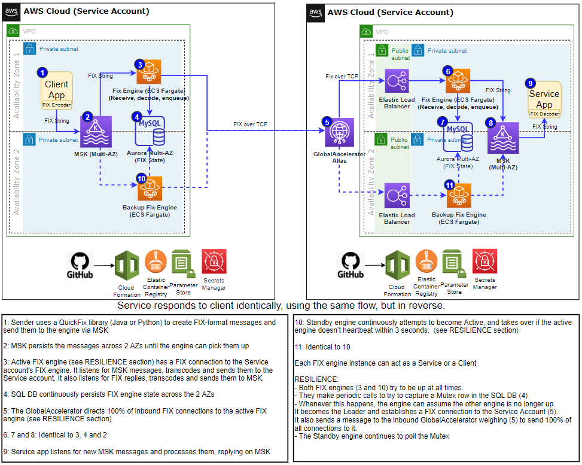
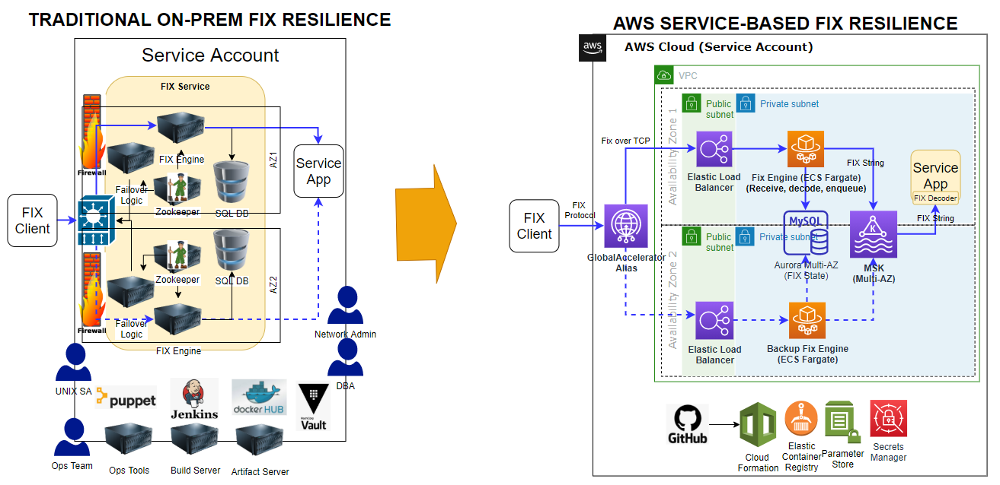

##Resilient FIX Engine on AWS
- Example implementation of an AWS FIX service, which provides automated HA failover with an RTO of seconds and 0 RPO.
- The implementation uses the QuickFixJ Java-based FIX engine to create FIX connections, and provides the ability to synchronize its state with a JDBC database (and a backup instance of itself).
- The provided Cloud Formation template and FIX encoding/decoding libraries from the QuickFix project can be used to quickly stand up the engine and use Java, Python, C++, Ruby, .NET or GO to use it to send and receive messages with any other FIX engine.

##Vision
- The FIX protocol has ushered in an era of straight-through processing in capital markets, replacing faxes and phone calls, and allowing firms to exchange data in real time.
- Along with the FIX engine, the  protocol allows vastly different institutions, technologies and architectures to communicate financial data to each other with minimal coupling and coordination effort.
- To achieve this, the FIX engine must be highly available and resilient against brief outages as well as data center failures, and allow participants to continue exchanging FIX messages.
- As FIX evolves and is more widely adopted, it holds the promise of allowing real-time processing of all post-trade events such as reconciliations, money movements, settlements, risk calculations and corporate actions.
- Upgrading the protocol and integrating new clients also requires extensive and labor-intensive testing of the proposed FIX infrastructure without disturbing existing Production connectivity.
- This requires an engine architecture that's trivial to set up, tear down, scale horizontally and test in parallel.
- The aim of this project is to provide such a solution.

##Purpose
- Build a cloud-native, highly available resilient FIX engine for financial services industry (FSI) to demonstrate how easy AWS makes it to quickly deploy and easily run complex, real-time services.
- Enable migration of proprietary protocols and low-latency on-prem FSI trading services to AWS.
- Demonstrate how this design pattern can be deployed and used with AWS products and services, with a clear focus on security, scale, and distinguishable operational excellence

##Architecture
- Open-source QuickFix engine and encoding/decoding libraries with Amazon's multi-region RDS database and MSK queues as well as Fargate containers, resilience and high availability becomes extremely simple to achieve.
- Amazon's VPC, NLB and Global Accelerator technologies makes it easy to securely expose the FIX service to internal and external users, and route them to the active engine instance.
- CloudFormation and SSM allows users to automatically create every component required to run a FIX server or client in a matter of minutes, and to reconfigure it without having to recreate it.
- Java engine deployed as a container on Fargate ECS
- Multi-AZ, multi-master database (MySQL) keep primary and secondary engine states in sync
- Multi-AZ MSK allows seamless client failover
- GlobalAccelerator transparently redirects clients to the currently active FIX engine
- Internal heartbeat allows FIX engines to perform leader election without external watchers
- 

##AWS vs. On-Prem Architecture
- AWS managed services vastly simplify the deployment and maintenance of complex components like databases, queues and compute containers
- This is much simpler than deploying the same components on traditional on-prem architectures
- 

##Pre-requisites
- An AWS account
- Cloud9 (for building the container image) https://docs.aws.amazon.com/cloud9/latest/user-guide/setup-express.html
- ECR (for hosting the container image) https://docs.aws.amazon.com/AmazonECR/latest/userguide/get-set-up-for-amazon-ecr.html
- (Optionally) An existing VPC and subnets (one public, one private) where you'd like to run the FIX engine (if you don't have one or would like a new one creatd, simply run the "VPC" version of the Cloud Formation template included with this project.
- The FIX port number and DNS name you intend to use (either as a FIX server or client)
- Download/install the QuickFix version appropriate for the language and FIX protocol version that's used for your application from http://www.quickfixengine.org/
- Download/install Kafka producer/consumer library appropriate for the language that's used for your application from https://cwiki.apache.org/confluence/display/KAFKA/Clients

##Installation
- Use Cloud9 to clone GitHub repo https://github.com/aws-samples/amazon-resilient-fix-engine-demo (git clone https://github.com/aws-samples/amazon-resilient-fix-engine-demo.git)
- If you'd like to create a new VPC and subnets for the FIX engine, download and run this CloudFormation template https://github.com/aws-samples/amazon-resilient-fix-engine-demo/blob/main/cloudformation/FIXEngineVPCApplication.yml
- If you'd like to share an existing VPC and subnets, download and run this CloudFormation template https://github.com/aws-samples/amazon-resilient-fix-engine-demo/blob/main/cloudformation/FIXEngineApplication.yml
- View the Primary and Failover ECS tasks' Log Groups in CloudFormation and see which one's been elected leader
- If you'd like to run the engine on an EC2 instance, ensure it has access to the MySQL, MSK, GlobalAccelerator and SSM services, and that you have Java 1.8 installed, then run:
<code>export APPLICATION_STACK_NAME="<STACK NAME THAT PREFIXES RELEAVANT PARAMETERS FOR THIS APP IN SSM PARAMETER STORE FixEngineOnAws-1-20>" ; export GLOBAL_ACCELERATOR_ENDPOINT_ARN="<GLOBAL ACCELERATOR ARN LIKE: arn:aws:elasticloadbalancing:us-east-1:123456789123:loadbalancer/net/FixEn-Failo-BM0E1KC5AQ2K/4df267784903750a>" ; java -jar fixengineonaws.jar <server.cfg OR client.cfg FILE LOCATION></code>

##Usage
- See FixEncoderDecoderDemo.java for an example of how to use QuickFixJ to build an order object, encode it into a FIX string and decode this string back into a new order object
- Use the QuickFix library for your language (link above) to construct a FIX message object and convert it to a FIX String (in Java this is just calling the toString() method)
- Connect to the MSK Kafka queue created by CloudFormation and send this string
- Subscribe to the same MSK Kafka queue to receive FIX reply strings from the target FIX server
- Use the QuickFix library to parse the retreived FIX message back into an object (using the appropriate-version XML template in quickfixj-messages-all-2.2.0.jar)

##Monitoring
- Navigate to CloudWatch to look at logs
- Click on ECS Cluster --> Click on Task Tab --> Click on Task --> Expand the Container and scroll down and click on View logs in CloudWatch
- or Go to CloudWatch and filter by stack name e.g. fixengineonaws-server-1-19
- Log group will be names as /ecs/fargate/FixEngineOnAws-Client-1-19 <stack-Name>
- within the log group, there will be 2 log streams for primary e.g. FixEngineOnAws-Client-1-19/Primary/FixEngineOnAws...... and failover FixEngineOnAws-Client-1-19/Failover/FixEngineOnAws.......

##Testing
- java -cp fixengineonaws.jar com.amazonaws.fixengineonaws.TestClient config/client.cfg
- java -cp fixengineonaws.jar com.amazonaws.fixengineonaws.TestClient config/server.cfg

##API Documentation
- You can find the QuickFix Message API documentation here https://javadoc.io/doc/org.quickfixj/quickfixj-core/latest/index.html
- You can find the QUickFix engine operating instructions here http://www.quickfixengine.org/quickfix/doc/html/

##References
* QuickFix: http://www.quickfixengine.org/
* Gradle User Guide Command-Line Interface (options you can use with `brazil-build`): https://docs.gradle.org/current/userguide/command_line_interface.html
* Gradle User Guide Java Plugin: https://docs.gradle.org/current/userguide/java_plugin.html
* Gradle User Guide Checkstyle Plugin: https://docs.gradle.org/current/userguide/checkstyle_plugin.html
* Gradle User Guide SpotBugs Plugin: http://spotbugs.readthedocs.io/en/latest/gradle.html
* Gradle User Guide JaCoCo Plugin: https://docs.gradle.org/current/userguide/jacoco_plugin.html
* Authoring Gradle Tasks: https://docs.gradle.org/current/userguide/more_about_tasks.html
* BrazilGradle and IDE: https://w.amazon.com/bin/view/BrazilGradle/#ide
* Executing tests using JUnit5 Platform: https://junit.org/junit5/docs/current/user-guide/#running-tests-build-gradle and https://docs.gradle.org/4.6/release-notes.html#junit-5-support
* This product includes software developed by quickfixengine.org http://www.quickfixengine.org/

## Security
- The Admin and Fix Service DB passwords are stored in SSM's Secrets Manager
- Access to the FIX engine subnet is limited to the FIX protocol TPC port selected by the user during installation
- Access to the MSK subnet is limited to the Kafka TCP port created by MSK during installation (see Parameter Store for the Kafka port number and endpoint DNS names)

## License
This library is licensed under the Apache 2.0 License. See the LICENSE file.

##Support
- If you have technical questions about this implementation, use https://github.com/orgs/aws-samples/teams/amazon-resilient-fix-engine-demo
- For any other questions about AWS services, contact `AWS Support <https://aws.amazon.com/contact-us>`__.

